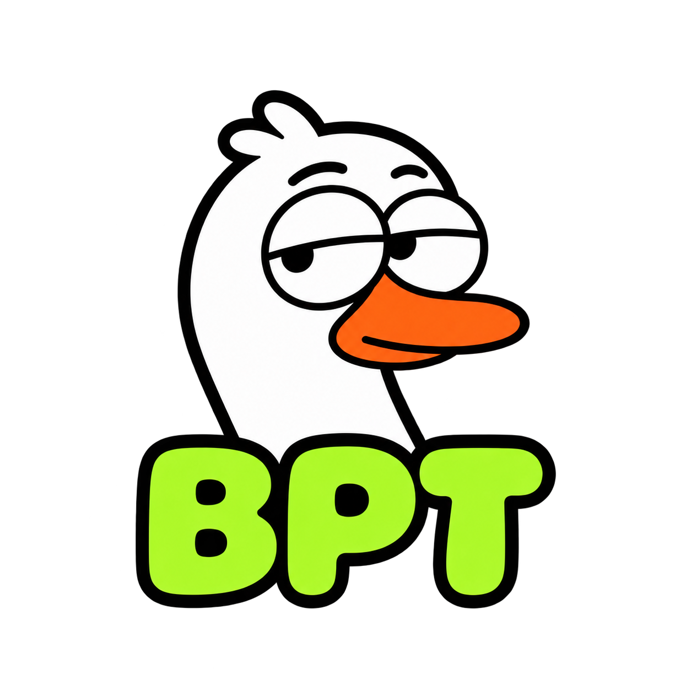
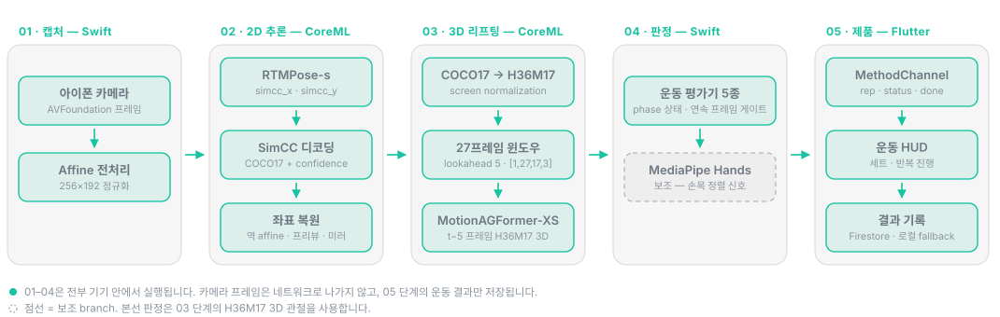

<div align="center">



**AI 기반 자세 분석 트레이닝 앱**

스마트폰 카메라만으로 운동 자세를 실시간 분석해 반복 횟수·세트 진행·자세 상태를 알려줍니다.

한밭대학교 캡스톤 디자인 I · 3인 팀 프로젝트 · 진행 중

`Flutter` · `Swift` · `CoreML` · `RTMPose-s` · `MotionAGFormer-XS` · `MediaPipe` · `Firebase`

</div>

---

카메라 프레임은 기기 밖으로 나가지 않습니다. Swift가 카메라 스트림을 받고, CoreML이 RTMPose-s로 2D keypoint를 뽑고, MotionAGFormer-XS가 27프레임 시계열을 3D 관절로 복원하고, 운동별 평가기가 관절 각도로 반복·자세 상태를 판정하고, Flutter가 운동 흐름과 기록을 담당합니다. 서버 추론도, 영상 업로드도 없습니다.

## 동작 방식

<div align="center">
  
</div>

AI단은 두 개의 CoreML 모델을 이어 붙인 구조입니다. RTMPose-s는 한 장의 이미지에서 COCO17 2D 관절을 찾는 front-end이고, MotionAGFormer-XS는 27프레임 2D 시계열을 받아 target frame의 H36M17 3D 관절을 복원하는 temporal 2D-to-3D lifter입니다.

```text
카메라 프레임 → full-image affine 192×256 → RTMPose-s → SimCC 디코딩 → 역 affine
→ COCO17 2D → H36M17 변환 · screen normalization
→ 27프레임 lookahead5 윈도우 → MotionAGFormer-XS → temporal index 21
→ target(t−5) 프레임의 COCO17 2D + H36M17 3D → 운동별 자세 판정
```

좌표계가 이 파이프라인의 첫 번째 난이도입니다. RTMPose 입력 좌표, 카메라 픽셀, 프리뷰 좌표, 셀피 미러 좌표가 전부 다르기 때문에 affine 변환 정보를 저장했다가 디코딩된 keypoint를 원본 화면 좌표계로 복원한 뒤에 평가와 skeleton overlay 렌더링을 합니다.

두 번째 난이도는 시간축입니다. lookahead가 5이므로 최신 프레임 `t`가 도착했을 때 3D로 확정할 수 있는 시점은 `t−5`이고, 같은 packet 안의 2D와 3D는 반드시 같은 frame index를 가리켜야 합니다. 입력 FPS 기준 5프레임(30FPS에서 약 167ms)의 알고리즘 지연은 모델 계산 시간과 별개로 발생합니다.

3D 단계는 CoreML 변환, 좌표 변환, 윈도우 구성, 추론, 출력 프레임 선택까지 macOS end-to-end로 검증했고, iOS 런타임 연결을 진행하고 있습니다.

| macOS 프로토타입 계측 | 값 |
| --- | ---: |
| 처리 프레임 | 240 (`assets/smoke/vedio_1.mp4`) |
| 추론·후처리 평균 (렌더 제외) | 12.73 ms |
| RTMPose-s CoreML 평균 | 2.56 ms |
| MotionAGFormer-XS CoreML 평균 | 7.93 ms |
| SimCC 디코딩 평균 | 0.05 ms |

macOS 프로토타입 수치이며 iPhone의 지연, thermal throttling, Neural Engine 배치를 보장하지 않습니다. 단계별 데이터 계약과 실패 처리 정책은 [이미지 입력부터 자세 판정 직전까지의 AI 파이프라인](docs/research/rtmpose_motionagformer_image_to_pose_pipeline.md)에 정리했습니다.

## 지원 운동

| 운동 | 평가기 | 주요 판정 요소 | 권장 카메라 각도 |
| --- | --- | --- | --- |
| 스쿼트 | `SquatEvaluator` | 무릎 각도, 고관절 각도, 상체 기울기, 하강·상승 단계 | 측면 45도 |
| 벤치프레스 | `BenchPressEvaluator` | 팔꿈치 각도, 어깨-팔꿈치-손목 정렬, 하강·상승 단계 | 측면 45도 |
| 데드리프트 | `DeadliftEvaluator` | 고관절 각도, 무릎 각도, 상체 기울기, 들어올림 진행 상태 | 측면 45도 |
| 바벨로우 | `BarbellRowEvaluator` | 상체 기울기, 팔꿈치 이동, 당김 동작 범위 | 측면 45도 |
| 푸쉬업 | `PushUpEvaluator` | 팔꿈치 각도, 어깨-팔꿈치-손목 정렬, 하강·상승 단계 | 측면 45도 |
| 랫풀다운 | `LatPulldownEvaluator` | 팔꿈치 각도, 견갑골 정렬, 당김 동작 범위 | 측면 45도 |

여섯 평가기 모두 같은 관절 입력을 공유하지만 임계값과 동작 단계 상태는 운동별로 분리돼 있습니다. 단일 프레임에서 발생하는 일시적인 keypoint 튐으로 반복 수가 오탐되지 않도록, 상태 전이에 **연속 프레임 확인**과 **후보 상태 누적** 방식을 적용했습니다.

평가기 출력은 `status`(현재 자세·운동 상태), `rep`(현재 반복 횟수), `done`(목표 반복 또는 세트 완료 여부) 세 가지이고, MethodChannel로 Flutter HUD에 전달됩니다.

## 사용 흐름

```text
회원가입/로그인 → (최초 1회) 온보딩: 성별 선택 → 키·몸무게 입력
      → 목표·주당 운동 횟수 설정 → 체형 자동 촬영(정면·좌·우 측면)
      → 체형 분석 진행 → 체형 측정 결과 확인 → 홈
      → 운동 종목 선택 → 목표 반복 수·세트 수 설정
      → 운동별 카메라 배치 안내 팝업 → 3·2·1 카운트다운
      → 실시간 자세 분석 (반복 수 · 세트 진행률 표시)
      → 세트 완료 → 운동 결과 저장 → 리포트·마이페이지에서 조회
```

체형 촬영은 버튼을 누르는 대신 가이드 안에서 가만히 서 있으면 자동으로 3장(정면·좌측면·우측면)을 찍습니다. 촬영이 끝나면 진행률 애니메이션과 함께 체형 분석 단계로 넘어가고, 완료 후 홈으로 이동합니다. 체형 측정 결과의 3D 뷰는 아직 뼈대만 구현된 상태이며 실제 3D 렌더링·자세 반영은 이어서 개발할 예정입니다.

운동 시작 버튼을 눌러도 바로 추론으로 넘어가지 않고 먼저 종목별 카메라 배치 안내를 띄웁니다. 사용자가 "확인했습니다"를 눌러야 운동 화면으로 이동하기 때문에, 잘못된 카메라 각도로 운동이 시작되는 경우를 줄입니다. 준비·카운트다운·라이브 단계 모두 뒤로가기를 지원하며, 이때는 운동 기록을 남기지 않고 즉시 이전 화면으로 복귀합니다.

## 팀과 역할

한밭대학교 캡스톤 디자인 I 3인 팀 프로젝트입니다.

| 팀원 | 담당 | 범위 |
| --- | --- | --- |
| 서진정 | 프론트엔드 | Flutter 화면 구성, Riverpod 상태 관리, 라우팅과 인증 가드, 온보딩·체형 촬영 플로우, 운동 흐름 UI, 리포트·프로필 화면 |
| 최한민 | 백엔드 | Firebase Authentication 인증, Cloud Firestore 운동 기록 저장·조회, SharedPreferences 로컬 캐시, 데이터 연동 |
| 전 준 | AI 전반 | 모델 조사와 CoreML 변환, iOS 네이티브 추론 파이프라인, 운동별 평가기, MediaPipe 손 보조 branch, Flutter–네이티브 연결, 3D 데이터셋 파이프라인 |

시스템은 아래 레이어로 나뉩니다.

| 레이어 | 역할 | 위치 |
| --- | --- | --- |
| Flutter UI | 운동 선택, 목표 설정, 운동 진행 화면, 반복 수·세트 HUD, 결과 화면 | `bpt/lib/features/` |
| iOS Native Swift/CoreML | 카메라 프레임 수집, 영상 전처리, CoreML 추론, keypoint 후처리, 운동별 평가 | `bpt/ios/Runner/NativePose/` |
| Python 레퍼런스 | 2D-to-3D 변환·윈도우·CoreML runner 구현과 단위 테스트, macOS end-to-end 벤치마크 | `pose_feedback/body/`, `scripts/` |
| 연결 | PlatformView 기반 네이티브 카메라 화면 임베드, MethodChannel 추론 결과 전달 | `NativePose/Bridge/` |
| Firebase | 이메일 기반 인증, 운동 기록 저장·조회, 기간별 통계 집계 | `AuthNotifier`, `WorkoutRecordsNotifier`, `reportDataProvider` |

Flutter 쪽은 `flutter_riverpod` 기반 단방향 상태 관리와 `go_router` 선언적 라우팅을 씁니다. UI 위젯이 Firebase나 데이터 처리 로직을 직접 호출하지 않고 Provider를 통해 필요한 상태만 전달받는 구조이며, 기능 단위로 코드를 분리하는 Feature-First 폴더 구조를 적용했습니다.

운동 기록은 3계층으로 저장합니다.

| 계층 | 저장소 | 역할 |
| --- | --- | --- |
| 1차 | Cloud Firestore | 프로필·신체 정보·운동 기록 영속 저장, 멀티 디바이스 동기화 |
| 2차 | SharedPreferences | Firestore 호출 실패 또는 네트워크 장애 시 임시 복원 |
| 3차 | Firebase Auth 기본 정보 | 로컬 캐시도 없을 때 이름·이메일 등 최소 정보 표시 |

### 운동 데이터셋

평가 기준과 3D 연구에 사용할 운동 영상은 3대 고정 카메라로 팀원 3명이 함께 촬영했습니다.

촬영본을 3D pseudo-label 데이터로 변환하는 파이프라인은 별도 저장소 [Exercise3D-Dataset-Pipeline](https://github.com/06-month/Exercise3D-Dataset-Pipeline)에서 관리합니다. 오디오/PTS 동기화, 고정 카메라 지오메트리, Sapiens2 2D pose, 타임스탬프 기반 triangulation, SAM 3D Body prior, sequence body fitting, 품질 메타데이터, private 데이터셋 export까지 end-to-end로 처리합니다.

| 항목 | 값 |
| --- | --- |
| 촬영 인원 | 3명 (팀 공동 촬영) |
| 운동 종목 | 6종 |
| 동기화 시퀀스 | 26개 (78 camera view / 3 고정 카메라) |
| 처리 프레임 | 65,595 |
| 처리 현황 | 24/26 freeze-ready, REVIEW 24 / FAIL 0 |

원본 RGB와 개인 식별 정보는 비공개이며, 해당 저장소는 코드와 집계 수치, mesh-only preview만 공개합니다. 현재 BPT 모바일 런타임은 이 데이터셋 없이 2D COCO17 keypoint만으로 동작합니다.

## 저장소 구조

| 경로 | 내용 |
| --- | --- |
| `bpt/` | Flutter 앱 + iOS 네이티브 카메라/CoreML/MediaPipe 런타임 |
| `pose_feedback/` | Python 포즈·손·손목·피드백 레퍼런스 구현 |
| `scripts/` | 모델 변환, 벤치마크, 진단, 시각화 |
| `tests/` | Python 단위·파이프라인 테스트 |
| `tools/` | Swift/Python 스모크·프로파일링 도구 |
| `docs/` | iOS 통합, CoreML 변환, 연구 노트 |
| `models/`, `assets/`, `external/` | 로컬 복원용 가이드 (가중치와 대용량 자산은 미커밋) |

## 실행

**권장 환경** — Flutter SDK (Dart `>=3.0.0 <4.0.0`), macOS + Xcode + CocoaPods, iOS 16.0 이상 iPhone 실기기, 전면 카메라, Firebase 프로젝트 설정

CoreML 기반 실시간 자세 분석은 카메라 입력과 온디바이스 추론을 사용하므로 시뮬레이터보다 실제 iPhone에서 실행하는 것을 권장합니다. 코드 서명 오류를 피하려면 클라우드 동기화 폴더가 아닌 로컬 개발 경로에서 빌드하세요.

```sh
git clone -b dev/ai https://github.com/06-month/BPT.git
cd BPT/bpt
flutter pub get
cd ios && pod install
open Runner.xcworkspace
```

`Runner.xcodeproj`가 아니라 `Runner.xcworkspace`를 여세요. Signing & Capabilities에서 Team을 설정하고 실기기를 연결해 `Runner` 스킴을 실행합니다. 런타임 모델은 `bpt/ios/Runner/NativePose/Models/`에 함께 버전 관리됩니다. Firebase 설정은 `lib/firebase_options.dart`(Flutter), `GoogleService-Info.plist`(iOS), `android/app/google-services.json`(Android)을 대상 프로젝트에 맞게 교체하세요.

Python 레퍼런스 테스트:

```sh
python3 -m venv .venv && source .venv/bin/activate
pip install -r requirements.txt
pytest
```

연구용 가중치와 upstream 저장소는 의도적으로 vendoring하지 않았습니다. 모델 실험 전에 [`assets/README.md`](assets/README.md), [`models/README.md`](models/README.md), [`external/README.md`](external/README.md)를 확인하세요.

## 현재 상태와 다음 단계

캡스톤 디자인 I은 종료가 아니라 검증된 1차 마일스톤입니다. 아래는 최종결과 보고서에 기록된 미구현·부분 구현 항목과 그에 대한 후속 계획입니다.

| 항목 | 상태 | 다음 단계 |
| --- | --- | --- |
| Android 실시간 AI 추론 | 부분 구현 (iOS 한정) | RTMPose-s를 TFLite 또는 ONNX Runtime Mobile로 변환, CameraX 입력 파이프라인 추가, 네이티브 추론 backend를 교체 가능한 구조로 확장 |
| FPS·지연 시간 (0.1초 이내, 최소 15FPS) | 부분 충족 (계측 산출물 없음) | 기기별 FPS, 평균·최대 추론 시간, 프레임 드롭률 계측 코드 추가 후 입력 해상도·프레임 스킵 등 경량화 적용 |
| 자세 오류 판정 정밀도 | 부분 충족 | A-pose 캘리브레이션으로 개인 체형·bone length를 추정해 관절각 기준을 보정, 기준 동작과 phase alignment 후 joint-level deviation 계산 |
| 손목·손 회전 분석 | 미충족 | MediaPipe Hand Landmarker를 body wrist 기준으로 정렬하고 손목 각도·손바닥 방향 feature를 계산, 손 방향이 중요한 운동부터 제한적으로 반영 |
| 3D temporal 자세 추정 | CoreML 변환·end-to-end 검증 완료, iOS 연결 진행 중 | `motionagformer_xs.mlpackage`를 앱 리소스에 추가, 27프레임 버퍼와 `t−5` 2D/3D 정렬 wrapper를 production 코드로 이관, 운동별 평가기를 3D 관절각 기준으로 전환 |
| 운동 영상 다시보기 · keypoint overlay 저장 | 미구현 | 세션 단위 영상과 프레임별 keypoint 시계열을 함께 저장하고, 다시보기 화면에서 타임스탬프 동기화해 overlay 재생 |
| 음성 피드백 | 미구현 | 운동별 `status`를 피드백 문장 사전과 매핑하고 cooldown 로직 적용 후 TTS 연동 |
| 비동기 상태 UX (네트워크 지연·장애) | 미충족 | loading / success / empty / error / offline / retrying 상태를 분리하고 스켈레톤 UI, 재시도 버튼, 오프라인 안내 제공 |
| PASS 본인 인증 · 소셜 로그인 | 미구현 (캡스톤 II 이월) | 외부 인증 SDK 연동과 기존 이메일 계정 병합 정책 설계 후 확장 |
| 관리자 대시보드 · 활동 로그 | 미구현 (캡스톤 II 이월) | 관리자 권한 체계, 활동 로그 스키마, 전체 사용자 통계 집계를 별도 모듈로 설계 |

운동별 임계값 기반 평가이므로 사용자 체형 차이, 카메라 각도, 운동 속도 차이가 결과에 영향을 줍니다. FPS·지연 시간·정확도 수치는 측정 조건과 함께 기록되기 전까지 주장하지 않습니다.

## 문서

- [이미지 입력부터 자세 판정 직전까지의 AI 파이프라인](docs/research/rtmpose_motionagformer_image_to_pose_pipeline.md)
- [네이티브 포즈 CoreML 파이프라인](docs/research/coreml_rtmpose_s_motionagformer_xs_pipeline.md)
- [RTMPose-s CoreML 변환 검토](docs/research/rtmpose_s_coreml_feasibility.md)
- [MediaPipe Hand CoreML 검토](docs/research/mediapipe_hand_coreml_feasibility.md)
- [iPhone CoreML 프로파일링 계획](docs/research/iphone_coreml_profiling_plan.md)
- [Exercise3D 데이터셋 파이프라인](https://github.com/06-month/Exercise3D-Dataset-Pipeline)

## 라이선스

프로젝트 전체 라이선스는 아직 선택하지 않았습니다. 서드파티 코드, 모델 설정, 번들 모델 자산은 각자의 원 라이선스를 따르므로 재배포 전에 확인이 필요합니다.
