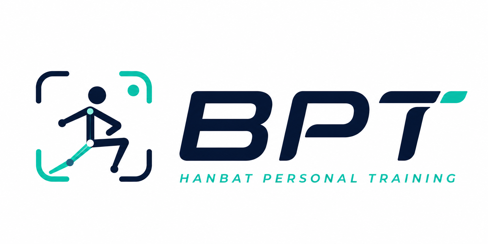
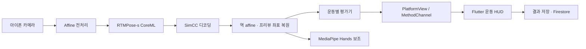

<div align="center">



**아이폰 카메라만으로 운동 자세를 실시간 분석하는 온디바이스 AI 코칭 앱**

한밭대학교 캡스톤 디자인 I · 3인 팀 프로젝트 · 진행 중

`Flutter` · `Swift` · `CoreML` · `RTMPose-s` · `MediaPipe` · `Firebase`

</div>

---

카메라 프레임은 기기 밖으로 나가지 않습니다. Swift가 카메라 스트림을 받고, CoreML이 RTMPose-s를 돌리고, 운동별 평가기가 관절 각도로 반복·자세 상태를 판정하고, Flutter가 운동 흐름과 기록을 담당합니다. 서버 추론도, 영상 업로드도 없습니다.

## 데모

<!--
스크린샷/데모 GIF를 docs/project/screens/ 에 넣고 아래 표의 경로를 맞춰주세요.
권장: 운동 선택 → 카메라 준비 → 실시간 HUD → 결과 화면, 4장.
-->

| 운동 선택 | 카메라 준비 | 실시간 판정 | 운동 결과 |
| --- | --- | --- | --- |
| _준비 중_ | _준비 중_ | _준비 중_ | _준비 중_ |

## 동작 방식



좌표계가 이 파이프라인의 핵심 난이도입니다. RTMPose 입력 좌표, 카메라 픽셀, 프리뷰 좌표, 셀피 미러 좌표가 전부 다르기 때문에 affine 변환을 보존했다가 디코딩된 키포인트를 원본과 프리뷰 공간으로 되돌린 뒤에 평가와 렌더링을 합니다.

## 지원 운동

| 운동 | 평가기 | 주요 신호 |
| --- | --- | --- |
| 스쿼트 | `SquatEvaluator` | 무릎·고관절 각도, 상체 기울기, 하강/상승 상태 |
| 벤치프레스 | `BenchPressEvaluator` | 팔꿈치 각도, 어깨-팔꿈치-손목 정렬, 내림/미는 상태 |
| 데드리프트 | `DeadliftEvaluator` | 고관절·무릎 각도, 상체 기울기, 리프팅 상태 |
| 바벨로우 | `BarbellRowEvaluator` | 상체 기울기, 팔꿈치 이동, 당김 범위 |
| 푸시업 | `PushUpEvaluator` | 팔꿈치 각도, 상체 정렬, 하강/상승 상태 |

다섯 평가기 모두 같은 COCO17 출력을 쓰지만 상태와 임계값은 운동별로 분리돼 있습니다. 반복 수는 단일 프레임 임계값이 아니라 후보 상태 누적 + 연속 프레임 확인으로 판정해서, 키포인트가 한 프레임 튀었다고 카운트가 올라가지 않습니다.

## 내가 구현한 부분

3인 팀 프로젝트이고, 아래는 Git author와 변경 파일로 확인되는 저장소 소유자([@06-month](https://github.com/06-month))의 범위입니다.

- **모델 선정과 변환** — RTMPose-s 및 대안 pose/3D 모델 조사, CoreML 변환, 비교·진단 도구
- **네이티브 추론 파이프라인** — AVFoundation 카메라 입력, CoreML 실행, SimCC 디코딩, affine 역변환과 프리뷰 좌표 매핑 (Swift 약 6,800줄)
- **운동 평가기 5종** — phase 상태 머신, 후보 상태 누적, 연속 프레임 게이트
- **MediaPipe Hands 보조 branch** — 손 오버레이와 손목 정렬 신호
- **Flutter–네이티브 연결** — `UiKitView` PlatformView 등록, per-view MethodChannel, 세트·반복 진행과 결과 화면 라우팅
- **Python 레퍼런스 파이프라인** — 포즈·손·손목·피드백 모듈과 테스트
- **[Exercise3D 데이터셋 파이프라인](https://github.com/06-month/Exercise3D-Dataset-Pipeline)** — 3대 카메라 동기화 영상을 3D pseudo-label 데이터로 만드는 별도 저장소 (26개 시퀀스 중 24개 freeze-ready, 65,595 프레임)

팀 공동 작업: Flutter 화면 전반과 디자인 시스템, Firebase 인증·Firestore 연동, 프로필·리포트·통계, 운동 데이터 촬영.

## 저장소 구조

| 경로 | 내용 |
| --- | --- |
| `bpt/` | Flutter 앱 + iOS 네이티브 카메라/CoreML/MediaPipe 런타임 |
| `pose_feedback/` | Python 포즈·손·손목·피드백 레퍼런스 구현 |
| `scripts/` | 모델 변환, 벤치마크, 진단, 시각화 |
| `tests/` | Python 단위·파이프라인 테스트 |
| `tools/` | Swift/Python 스모크·프로파일링 도구 |
| `docs/` | iOS 통합, CoreML 변환, 연구 노트 |
| `models/`, `assets/`, `external/` | 로컬 복원용 가이드 (가중치와 대용량 자산은 미커밋) |

## 실행

**요구 사항** — Flutter (Dart `>=3.0.0 <4.0.0`), macOS + Xcode + CocoaPods, iOS 15 이상 실기기, Firebase 프로젝트 설정

```sh
git clone -b dev/ai https://github.com/06-month/BPT.git
cd BPT/bpt
flutter pub get
cd ios && pod install
open Runner.xcworkspace
```

`Runner.xcodeproj`가 아니라 `Runner.xcworkspace`를 여세요. 서명 팀을 선택하고 실기기에서 `Runner` 스킴을 실행합니다. 런타임 모델은 `bpt/ios/Runner/NativePose/Models/`에 함께 버전 관리됩니다. Firebase 설정은 `lib/firebase_options.dart`를 대상 프로젝트에 맞게 교체하세요.

Python 레퍼런스 테스트:

```sh
python3 -m venv .venv && source .venv/bin/activate
pip install -r requirements.txt
pytest
```

연구용 가중치와 upstream 저장소는 의도적으로 vendoring하지 않았습니다. 모델 실험 전에 [`assets/README.md`](assets/README.md), [`models/README.md`](models/README.md), [`external/README.md`](external/README.md)를 확인하세요.

## 현재 상태와 다음 단계

캡스톤 디자인 I은 종료가 아니라 검증된 1차 마일스톤입니다. 지금 확인된 한계가 그대로 다음 작업 목록입니다.

| 한계 | 다음 단계 |
| --- | --- |
| 기기별 FPS·지연 시간 측정 자료 없음 | 실기기 프로파일링 (FPS, latency, frame drop, thermal) |
| 반복·자세 판정 정확도 벤치마크 없음 | 운동별 validation clip과 기준 annotation으로 오차 측정 |
| 네이티브 결과가 반복 수 중심 | `status`·evidence를 성공/실패 반복, 자세 점수, 피드백 히스토리에 연결 |
| 손목 정밀 피드백 미활성 | projection validity와 hand confidence 게이트 통과 시에만 활성화 |
| 3D temporal pose 앱 비활성 | Exercise3D 데이터로 안정성·체형 보정·phase 정렬 검증 후 판단 |
| iOS 전용 | 측정 기준 확립 후 Android (CameraX + TFLite/ONNX Runtime) 백엔드 |

2D 포즈와 운동별 임계값 기반이므로 촬영 각도, 가림, 체형, 동작 속도가 결과에 영향을 줍니다. FPS·지연 시간·정확도 수치는 측정 조건과 함께 기록되기 전까지 주장하지 않습니다.

## 문서

- [네이티브 포즈 CoreML 파이프라인](docs/research/coreml_rtmpose_s_motionagformer_xs_pipeline.md)
- [RTMPose-s CoreML 변환 검토](docs/research/rtmpose_s_coreml_feasibility.md)
- [MediaPipe Hand CoreML 검토](docs/research/mediapipe_hand_coreml_feasibility.md)
- [iPhone CoreML 프로파일링 계획](docs/research/iphone_coreml_profiling_plan.md)
- [Exercise3D 데이터셋 파이프라인](https://github.com/06-month/Exercise3D-Dataset-Pipeline)

## 라이선스

프로젝트 전체 라이선스는 아직 선택하지 않았습니다. 서드파티 코드, 모델 설정, 번들 모델 자산은 각자의 원 라이선스를 따르므로 재배포 전에 확인이 필요합니다.
