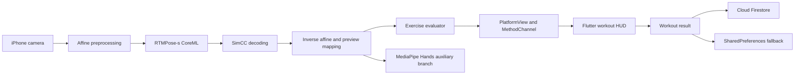

# BPT - On-device AI Exercise Coaching

BPT (Hanbat Personal Training) is a Flutter mobile application that analyzes exercise motion on an iPhone and turns 2D body keypoints into repetition, phase, and posture-state feedback. The runtime keeps camera frames on the device: Swift captures the camera stream, CoreML runs RTMPose-s, exercise-specific evaluators interpret the pose, and Flutter presents the workout flow and stores the result.

> Current Capstone Design I scope: the real-time AI path runs on iOS and evaluates five exercises from 2D body pose. MediaPipe Hands is an auxiliary visualization and wrist-alignment branch. Fine-grained wrist feedback and temporal 3D pose remain research-stage work and are not presented as completed product features.

**Project status: active development.** Capstone Design I is treated as a validated implementation milestone, not the end of the project. The next work is driven by the limitations measured or identified in that milestone.

## Problem and scope

Exercise feedback on a phone has to connect several concerns that are often evaluated separately:

- stable camera capture and low-latency on-device inference;
- consistent conversion between model, image, preview, and mirrored coordinates;
- exercise phase tracking that does not count a repetition from a single noisy frame;
- a mobile workflow for preparation, countdown, sets, results, authentication, and history;
- honest handling of input failures, body-shape variation, and camera-angle sensitivity.

BPT addresses this as an integrated product pipeline rather than as a standalone pose-estimation demo.

## What is implemented

### Mobile product workflow

The Flutter application provides:

- email authentication through Firebase Authentication;
- Riverpod-based state separation and `go_router` navigation guards;
- exercise selection, repetition and set targets, camera guidance, and countdown;
- a native iOS camera view embedded with `UiKitView`;
- workout result storage through Cloud Firestore with a SharedPreferences fallback;
- daily, weekly, and monthly workout summaries;
- Korean and English UI resources.

### On-device pose pipeline

The iOS runtime follows this path:

1. capture a front-camera frame with AVFoundation;
2. normalize and affine-warp the frame for RTMPose-s;
3. run the bundled CoreML model;
4. decode SimCC outputs into COCO17 keypoints and confidence values;
5. restore keypoints to image and preview coordinates, including mirroring;
6. evaluate exercise phase and joint-angle conditions;
7. return `rep`, `status`, and `done` through a per-view MethodChannel;
8. update Flutter set progress and route to the workout result flow.



### Exercise evaluators

All five evaluators share the body-pose output but keep exercise-specific state and thresholds.

| Exercise | Evaluator | Main signals |
| --- | --- | --- |
| Squat | `SquatEvaluator` | knee and hip angles, torso inclination, descent/ascent state |
| Bench press | `BenchPressEvaluator` | elbow angle, shoulder-elbow-wrist alignment, lowering/pressing state |
| Deadlift | `DeadliftEvaluator` | hip and knee angles, torso inclination, lifting state |
| Barbell row | `BarbellRowEvaluator` | torso inclination, elbow motion, pull range |
| Push-up | `PushUpEvaluator` | elbow angle, shoulder-elbow-wrist alignment, descent/ascent state |

Candidate-state accumulation and consecutive-frame confirmation reduce repetition changes caused by transient keypoint noise. These heuristics improve runtime stability, but they are not a substitute for a measured accuracy benchmark.

## Key engineering decisions

### Keep inference on the device

Camera frames are processed in the native iOS layer and are not sent to an inference server. This reduces dependence on network conditions and avoids uploading workout video for real-time analysis.

### Separate Flutter product logic from the native AI runtime

Flutter owns product navigation, preparation, set progression, results, and data persistence. Swift owns camera capture, CoreML execution, coordinate restoration, overlays, and exercise evaluation. `PlatformView` and `MethodChannel` form the boundary between the two layers.

### Restore coordinates before evaluation and rendering

RTMPose input coordinates, camera pixels, preview coordinates, and mirrored selfie coordinates are different spaces. The native pipeline preserves the affine transform and explicitly maps decoded keypoints back to the source and preview spaces.

### Treat hand and 3D models as scoped extensions

MediaPipe Hand Landmarker is currently used as an auxiliary hand overlay and wrist-alignment source. It does not yet drive wrist-bend or palm-rotation feedback. MotionAGFormer and other 2D-to-3D paths are retained as research and conversion tools, but the app evaluator currently consumes 2D COCO17 keypoints.

## Related 3D dataset pipeline

The three-person capstone team jointly recorded the exercise videos. The project owner then designed and implemented the separate [Exercise3D Dataset Pipeline](https://github.com/06-month/Exercise3D-Dataset-Pipeline), which turns synchronized three-camera recordings into quality-tracked 3D pseudo-label data.

Its processing path covers audio/PTS synchronization, fixed-camera geometry, Sapiens2 2D pose, timestamp-aware triangulation, SAM 3D Body priors, sequence body fitting, quality metadata, and immutable private-dataset export. The repository publishes code, non-identifying aggregate measurements, and mesh-only previews rather than the private recordings.

| Dataset snapshot | Value |
| --- | --- |
| Participants | 3, recorded collaboratively by the team |
| Exercises | 6 |
| Synchronized sequences | 26 |
| Camera views | 78 across 3 fixed cameras |
| Working frames | 65,595 |
| End-to-end status | 24/26 freeze-ready, REVIEW 24 / FAIL 0 |

This dataset work is related follow-up infrastructure for 3D research and evaluation. The current BPT mobile runtime does not require the private dataset and still evaluates 2D COCO17 keypoints on the device.

## Team project and verified development scope

The final report identifies BPT as a three-person capstone project but does not include an individual role-allocation table. The attribution below combines Git authorship, file-level commit evidence, and the project owner's 2026-08-17 role confirmation rather than treating the entire application as one person's work.

| Area | Scope in this repository | Attribution evidence |
| --- | --- | --- |
| Flutter product foundation | screens, Riverpod state, authentication flow, profile, reports, Firebase and local persistence | team result; history is primarily associated with `jinjeonz` and `Han-min` |
| AI research and prototyping | pose/hand/wrist reference modules, model conversion, comparison, diagnostics, and tests | project owner's AI branch and commit `08d68c5` |
| Native iOS AI engine | camera capture, RTMPose-s CoreML inference, SimCC decoding, coordinate transforms, five evaluators, MediaPipe hand branch | project owner commit `3394f6c` (`06-month`) |
| Flutter-native workout integration | PlatformView registration, MethodChannel updates, preparation/countdown flow, set progression, result routing | project owner commit `3394f6c` (`06-month`) |
| Camera preview stabilization | preview mapping and workout-screen integration fixes | project owner commit `4bc3865` (`06-month`) |
| Exercise video capture | three-camera recordings used by the related dataset project | all three team members, confirmed by the project owner |
| 3D dataset generation | end-to-end synchronization, camera geometry, pose, triangulation, body fitting, quality control, and export pipeline | implemented by the project owner in `Exercise3D-Dataset-Pipeline`; all 124 commits map to owner identities |

The project owner's verifiable and confirmed technical scope is therefore the AI model investigation, Python evaluation tooling, CoreML conversion and post-processing, native Swift inference pipeline, exercise evaluators, Flutter-native camera integration, and the separate 3D dataset generation pipeline. Data recording is credited to the full team. General Flutter UI, Firebase, profile, and reporting features are described as team outcomes rather than individual work.

Commit counts are not used as contribution weights. See [process.md](process.md) for the evidence, uncertainty labels, and documentation decisions behind this summary.

## Current milestone and verification

| Check | Result |
| --- | --- |
| Manual Xcode validation | completed by the project owner on 2026-08-17 |
| Flutter static analysis | `flutter analyze` passed |
| Python reference tests | 132 tests passed |
| iOS dependency resolution | `pod install` completed with 27 pods |
| Repository hygiene | generated builds, Pods, downloaded research weights, videos, and experiment outputs are excluded |

The repository does not contain a device-by-device FPS, latency, frame-drop, or posture-accuracy benchmark. No numerical real-time or accuracy claim is made until those measurements are recorded with hardware and test conditions.

## Known limitations

- Real-time AI inference is implemented only for iOS; Android needs a separate CameraX and TFLite or ONNX Runtime Mobile backend.
- Evaluation is based on 2D pose and exercise-specific thresholds, so camera angle, occlusion, body proportions, and movement speed can affect results.
- The native result handoff is currently repetition-centric. Correct/incorrect repetition counts, posture score, and feedback history are not yet populated by the native path.
- Hand landmarks do not yet drive wrist-bend or palm-rotation feedback.
- The temporal 3D pose path is not active in the application.
- User workout video recording, keypoint-overlay replay, voice feedback, social login, and administrator analytics are not implemented.
- No project-wide license has been selected. Third-party code, model configuration, and model assets remain subject to their original licenses; review them before redistribution.

## Active roadmap

The project continues from the Capstone Design I milestone in this order:

1. add device-level profiling for FPS, inference latency, frame drops, and thermal behavior;
2. define exercise-specific evaluation sets and measure repetition and phase errors;
3. connect native `status` and evaluator evidence to correct/incorrect repetitions, posture score, and feedback history;
4. activate wrist-bend and palm-orientation feedback only where camera projection and hand confidence are valid;
5. use the Exercise3D dataset pipeline for 3D/reference-trajectory experiments without presenting pseudo-labels as ground truth;
6. validate temporal 3D pose, body-proportion normalization, and phase alignment before enabling them in the app;
7. add an Android inference backend after the iOS path has measurable stability criteria;
8. extend the product with replay, voice feedback, richer offline/error states, and additional authentication or administrator features.

Each stage should keep the current boundary between completed runtime behavior, experimental branches, and future work.

## Repository layout

| Path | Purpose |
| --- | --- |
| `bpt/` | Flutter application and native iOS camera/CoreML/MediaPipe runtime |
| `pose_feedback/` | modular Python pose, hand, wrist, and feedback reference implementation |
| `scripts/` | conversion, benchmarking, diagnostics, and visualization commands |
| `tests/` | Python unit and pipeline tests |
| `tools/` | minimal Swift and Python smoke/profiling tools |
| `docs/` | iOS integration, CoreML, research, and project documents |
| `models/` | RTMPose configuration files and local model setup guidance |
| `assets/` | guidance for local research inputs and generated outputs |
| `external/` | pinned revisions for optional upstream research repositories |

## Run the Flutter and iOS app

### Requirements

- Flutter with Dart `>=3.0.0 <4.0.0`
- macOS, Xcode, and CocoaPods for the iOS AI runtime
- an iPhone running iOS 15 or later; a physical device is recommended for camera and performance validation
- Firebase configuration for the target project

### Setup

```sh
git clone https://github.com/06-month/BPT-unified.git
cd BPT-unified/bpt
flutter pub get
cd ios
pod install
open Runner.xcworkspace
```

Open `Runner.xcworkspace`, not `Runner.xcodeproj`. Select a signing team and a physical iPhone, then run the `Runner` scheme. The runtime models are versioned under `bpt/ios/Runner/NativePose/Models/`.

Firebase initialization uses `lib/firebase_options.dart`; replace the checked-in project configuration when deploying to a different Firebase project.

## Run the Python reference tests

```sh
python3 -m venv .venv
source .venv/bin/activate
python -m pip install -r requirements.txt
pytest
```

Downloaded research weights and upstream repositories are intentionally not vendored. See [assets/README.md](assets/README.md), [models/README.md](models/README.md), and [external/README.md](external/README.md) before running model-specific experiments.

## Documentation

- [Documentation plan](plan.md)
- [Evidence and contribution review](process.md)
- [Repository consolidation record](docs/migration.md)
- [Native pose integration plan](docs/ios/native-pose-integration-plan.md)
- [CoreML and research notes](docs/research/coreml.md)
- [Project presentation](docs/project/BPT%EA%B3%84%ED%9A%8D%EB%B0%9C%ED%91%9C.pptx)
- [Exercise3D Dataset Pipeline](https://github.com/06-month/Exercise3D-Dataset-Pipeline)

The 24-page Capstone Design I final report was used as a factual snapshot of the first milestone. It is not committed here because the source copy contains student identifiers. The project remains in active development after that report.
