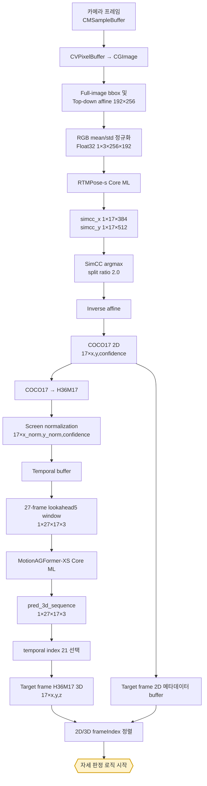

# RTMPose-s → MotionAGFormer-XS 기준 AI 파이프라인

> 범위: 카메라 이미지 입력부터 운동별 자세 판정 로직에 전달하기 직전까지
> 기준일: 2026-09-02

## 1. 결론

BPT의 AI 모델 파이프라인은 다음 구조를 기준으로 한다.

```text
카메라 이미지
→ RTMPose-s Core ML
→ COCO17 2D keypoint
→ H36M17 변환 및 screen normalization
→ 27프레임 lookahead5 window
→ MotionAGFormer-XS Core ML
→ target frame H36M17 3D keypoint
→ 운동별 자세 판정 로직
```

RTMPose는 단일 이미지에서 2D 관절을 찾는 front-end이고, MotionAGFormer는 27프레임의 2D 관절 시계열을 이용해 target frame의 3D 관절을 복원하는 temporal 2D-to-3D lifter다.

이 파이프라인의 모델 변환, 입출력 규격, COCO17→H36M17 adapter, temporal window, Core ML 호출 및 3D 출력 선택 로직은 저장소에 구현되어 있고 테스트되어 있다. 다만 실제 `bpt` iOS 카메라 화면에는 MotionAGFormer 연결부가 아직 들어가지 않아 현재 앱은 RTMPose 2D에서 바로 evaluator로 이동한다. 이 문서는 현재의 2D 단축 경로가 아니라 **MotionAGFormer를 포함하는 기준 AI 파이프라인**을 설명한다.

## 2. 문서의 시작점과 종료점

- 시작점: iOS 카메라의 `CMSampleBuffer` 또는 동영상에서 읽은 한 프레임
- 종료점: 동일 target frame에 정렬된 `COCO17 2D`와 `H36M17 3D`가 자세 평가기에 전달되기 직전
- 포함: 카메라 프레임 변환, RTMPose 전처리·추론·후처리, joint format 변환, MotionAGFormer 입력 구성·추론·출력 선택
- 제외: 관절각 임계값, 운동 phase, 반복 횟수, 자세 오류, 사용자 피드백 문장 생성

## 3. 전체 데이터 흐름



## 4. 단계별 데이터 계약

| 단계 | 데이터 | shape / 타입 | 좌표계 또는 의미 |
| --- | --- | --- | --- |
| 카메라 | `CMSampleBuffer` | video frame | iOS capture output |
| RTMPose 전처리 | `input_image` | `[1,3,256,192] Float32` | NCHW, normalized RGB |
| RTMPose 출력 X | `simcc_x` | `[1,17,384]` | 관절별 x-axis score |
| RTMPose 출력 Y | `simcc_y` | `[1,17,512]` | 관절별 y-axis score |
| RTMPose 후처리 | `coco17` | `[17,3]` | 원본 이미지 pixel `(x,y,confidence)` |
| joint adapter | `h36m17` | `[17,3]` | H36M 순서의 pixel `(x,y,confidence)` |
| Motion frame | normalized H36M17 | `[17,3]` | `(x_norm,y_norm,confidence)` |
| Motion input | `input_2d_sequence` | `[1,27,17,3] Float32` | 27프레임 temporal window |
| Motion output | `pred_3d_sequence` | `[1,27,17,3]` | H36M17 model-space `(x,y,z)` |
| 최종 AI 출력 | `selected3D` | `[17,3]` | target frame의 H36M17 3D joints |

## 5. 모델 초기화

실시간 세션을 시작할 때 모델은 프레임마다 다시 만들지 않고 한 번씩 로드한다.

```text
rtmpose_s_forward.mlpackage
motionagformer_xs.mlpackage
```

두 모델 모두 다음과 같이 Core ML이 사용 가능한 compute unit을 선택하도록 구성한다.

```swift
let config = MLModelConfiguration()
config.computeUnits = .all
```

`.all`은 CPU, GPU, Neural Engine을 모두 후보로 허용한다는 뜻이지 Neural Engine 사용을 보장한다는 뜻은 아니다.

세션 단위로 함께 유지해야 하는 객체는 다음과 같다.

```text
RTMPose MLModel
MotionAGFormer MLModel
MotionAGFormerInputBuilder(lookahead: 5)
target frame용 frameIndex/timestamp/COCO17 ring buffer
```

운동 종료, 카메라 재시작, 전후면 전환, 입력 해상도 변경 시 temporal buffer를 반드시 reset해야 한다. 서로 다른 세션의 프레임이 하나의 27프레임 window에 섞이면 안 된다.

## 6. 카메라 이미지 획득

현재 iOS 카메라 계층의 기본 설정은 다음과 같다.

| 항목 | 값 |
| --- | --- |
| API | `AVCaptureSession` |
| preset | `.hd1280x720` |
| 카메라 | 전면 wide 우선, 없으면 후면 wide |
| pixel format | `kCVPixelFormatType_32BGRA` |
| orientation | portrait |
| front camera | capture output mirroring 적용 |
| processing | `.userInitiated` 직렬 queue |

프레임 변환 경로는 다음과 같다.

```text
CMSampleBuffer
→ CMSampleBufferGetImageBuffer
→ CVPixelBuffer
→ CIImage
→ CIContext.createCGImage
→ CGImage
```

MotionAGFormer는 이미지 자체를 입력으로 받지 않는다. 모든 이미지 처리는 RTMPose 단계에서 끝나며, 이후에는 관절 배열만 전달된다.

## 7. RTMPose 전처리

### 7.1 기준 전처리 정책

MotionAGFormer end-to-end Core ML 테스트에서 사용한 RTMPose 전처리는 full-image bbox 기반의 MMPose-style top-down affine이다.

원본 이미지 크기를 `(W,H)`라고 하면:

```text
bbox   = [0, 0, W, H]
center = [W/2, H/2]
scale  = [W, H] × 1.25
```

여기에 모델 입력 종횡비 `192/256 = 0.75`를 맞춘다.

```text
if scaleW > scaleH × 0.75:
    scaleH = scaleW / 0.75
else:
    scaleW = scaleH × 0.75
```

이 center와 scale로 원본 이미지에서 `192×256` 입력으로 가는 affine matrix와 반대 방향 inverse affine matrix를 함께 만든다.

```text
원본 이미지 좌표 ──warp affine──> RTMPose 입력 좌표
원본 이미지 좌표 <─inverse affine─ RTMPose 입력 좌표
```

scale에 `1.25`를 곱하므로 원본 프레임 주위에 여유 영역을 둔다. affine sampling 중 원본 밖을 참조하면 RGB `(0,0,0)`을 사용한다.

### 7.2 현재 앱 fast resize와의 차이

현재 `bpt` 카메라 코드는 full-image affine이 아니라 원본 전체를 `192×256`으로 직접 늘리거나 줄이는 fast path를 호출한다. 반면 MotionAGFormer end-to-end Python/Swift scaffold는 위의 affine 정책으로 테스트되었다.

MotionAGFormer를 앱에 연결할 때는 두 정책 중 하나를 명시적으로 선택해야 한다.

- 기준 테스트와 동일성을 우선하면 full-image affine 경로를 사용한다.
- 현재 fast resize를 유지하면 RTMPose 2D 출력부터 MotionAGFormer 3D 출력까지 다시 품질·수치 검증해야 한다.

이 문서의 나머지 RTMPose 좌표 복원 설명은 검증 파이프라인의 affine 방식을 기준으로 한다.

### 7.3 RGB 정규화

affine 결과를 RGB Float32로 바꾸고 채널별로 다음 식을 적용한다.

```text
R' = (R - 123.675) / 58.395
G' = (G - 116.280) / 57.120
B' = (B - 103.530) / 57.375
```

결과 tensor는 NCHW 순서다.

```text
name   = input_image
shape  = [1, 3, 256, 192]
dtype  = Float32
layout = NCHW
```

## 8. RTMPose-s Core ML 추론

`rtmpose_s_forward`는 완성된 detection pipeline이 아니라 RTMPose-s의 신경망 forward만 포함한다.

```text
input_image
→ model.extract_feat
→ model.head
→ simcc_x, simcc_y
```

| 항목 | 값 |
| --- | --- |
| backbone | CSPNeXt-S 계열 |
| head | RTMCCHead |
| 입력 | `input_image [1,3,256,192]` |
| 출력 X | `simcc_x [1,17,384]` |
| 출력 Y | `simcc_y [1,17,512]` |
| SimCC split ratio | `2.0` |
| DARK refinement | 사용하지 않음 |
| person detector | 모델에 포함되지 않음 |

현재 기준 정책은 프레임 전체를 한 명의 person bbox로 간주한다. multi-person detection이나 사람 선택 로직은 없다.

## 9. SimCC 디코딩

관절 `j = 0...16`마다 x축과 y축 score에서 각각 최대 위치를 찾는다.

```text
xIndex = argmax(simcc_x[0,j,:])
yIndex = argmax(simcc_y[0,j,:])

xInput = xIndex / 2.0
yInput = yIndex / 2.0
confidence = min(max(simcc_x[0,j,:]), max(simcc_y[0,j,:]))
```

`384/2 = 192`, `512/2 = 256`이므로 나눈 결과가 RTMPose 입력 이미지 좌표가 된다.

`confidence <= 0`이면 해당 좌표를 invalid sentinel로 설정한다.

```text
xInput = -0.5
yInput = -0.5
```

현재 confidence는 Swift/Python 후처리에서 softmax로 확률화한 값이 아니라 모델이 출력한 두 축 최대 score 중 작은 값이다.

## 10. 원본 이미지 좌표 복원

SimCC로 얻은 `192×256` 좌표에 전처리 단계에서 보관한 inverse affine을 적용한다.

```text
[xImage, yImage] = inverseAffine([xInput, yInput])
```

각 관절은 다음 형식으로 만들어진다.

```text
PoseKeypoint(x: Double, y: Double, confidence: Double)
```

정상적으로 decode되면 17개의 COCO keypoint가 생성된다.

```text
coco17.shape = [17,3]
coco17[j]    = [xImage, yImage, confidence]
```

좌표는 원본 이미지 좌상단이 원점이고, x는 오른쪽, y는 아래쪽으로 증가한다.

## 11. COCO17 관절 순서

| index | 관절 | index | 관절 |
| ---: | --- | ---: | --- |
| 0 | nose | 1 | left eye |
| 2 | right eye | 3 | left ear |
| 4 | right ear | 5 | left shoulder |
| 6 | right shoulder | 7 | left elbow |
| 8 | right elbow | 9 | left wrist |
| 10 | right wrist | 11 | left hip |
| 12 | right hip | 13 | left knee |
| 14 | right knee | 15 | left ankle |
| 16 | right ankle |  |  |

이 COCO17은 RTMPose 결과이며 아직 MotionAGFormer 입력 순서가 아니다.

## 12. COCO17 → H36M17 변환

MotionAGFormer는 Human3.6M 방식의 17관절 순서를 사용하므로 adapter가 필요하다.

| H36M index | 이름 | COCO17로부터 생성하는 방법 |
| ---: | --- | --- |
| 0 | pelvis | `(leftHip + rightHip) / 2` |
| 1 | right hip | `rightHip` |
| 2 | right knee | `rightKnee` |
| 3 | right ankle | `rightAnkle` |
| 4 | left hip | `leftHip` |
| 5 | left knee | `leftKnee` |
| 6 | left ankle | `leftAnkle` |
| 7 | spine | `(pelvis + thorax) / 2` |
| 8 | thorax | `(leftShoulder + rightShoulder) / 2` |
| 9 | neck | `(nose + thorax) / 2` |
| 10 | head | `(leftEye + rightEye) / 2` |
| 11 | left shoulder | `leftShoulder` |
| 12 | left elbow | `leftElbow` |
| 13 | left wrist | `leftWrist` |
| 14 | right shoulder | `rightShoulder` |
| 15 | right elbow | `rightElbow` |
| 16 | right wrist | `rightWrist` |

직접 대응되는 관절은 좌표와 confidence를 그대로 복사한다. 두 관절로 합성하는 pelvis, thorax, spine, neck, head의 confidence도 해당 입력 confidence들의 평균으로 만든다.

COCO에 없는 spine·thorax·neck·head를 2D 관절 평균으로 합성하기 때문에 이 mapping은 근사값이다. 특히 입력 2D가 흔들리면 MotionAGFormer depth에도 영향을 줄 수 있다.

## 13. MotionAGFormer screen normalization

H36M17의 pixel 좌표를 MotionAGFormer가 기대하는 screen coordinate로 바꾼다.

원본 이미지 크기가 `(W,H)`일 때:

```text
xNorm = x / W × 2 - 1
yNorm = y / W × 2 - H/W
```

y도 `H`가 아니라 `W`로 나누는 것이 중요하다. 이는 VideoPose3D 계열의 `normalize_screen_coordinates` 규약을 따른다.

관절별 입력 channel은 다음 세 개다.

```text
[xNorm, yNorm, confidence]
```

따라서 단일 프레임의 MotionAGFormer 입력 전 단계 shape는 다음과 같다.

```text
normalizedFrame.shape = [17,3]
```

## 14. 손목 좌표 source

MotionAGFormer 기준 기본 입력은 RTMPose가 만든 COCO17을 그대로 사용한다.

```text
motionagformer_wrist_source = rtmpose
```

연구 코드에는 MediaPipe Hand의 손목으로 COCO index 9와 10의 `(x,y)`만 교체하는 실험 모드가 있다. 이 경우에도 confidence는 RTMPose 값을 유지한다.

```text
wrist_source = mediapipe
→ left  COCO[9].x/y 교체
→ right COCO[10].x/y 교체
→ confidence는 RTMPose 값 유지
```

이 기능은 optional experiment이며 기준 `RTMPose → MotionAGFormer` 경로에는 포함하지 않는다. 현재 iOS 앱의 MediaPipe Hand 분기도 자세 평가가 아니라 overlay 용도다.

## 15. 27프레임 lookahead5 window

### 15.1 모델 입력 크기

MotionAGFormer-XS Core ML 모델은 고정 27프레임 입력을 받는다.

```text
input_2d_sequence.shape = [1,27,17,3]
```

- batch: `1`
- temporal frames: `27`
- joints: `17`
- channels: `xNorm`, `yNorm`, `confidence`

### 15.2 offline 테스트의 window

target frame을 `i`, lookahead를 `5`라고 하면 테스트 파이프라인은 다음 범위를 만든다.

```text
window start = i - 21
window end   = i + 5
window       = [i-21, ..., i, ..., i+5]
```

27개 window 안에서 target `i`의 위치는 다음과 같다.

```text
targetTemporalIndex = 27 - 1 - 5 = 21
```

즉 output index 21이 target frame `i`의 3D 결과다. 시퀀스 시작과 끝에서 범위를 벗어난 index는 첫 프레임 또는 마지막 프레임을 반복하여 padding한다.

### 15.3 live 카메라의 frame 정렬

실시간에서는 미래 프레임을 즉시 볼 수 없다. 최신 도착 프레임이 `t`이면 `t`를 포함해 모은 window로 확정할 수 있는 target은 `t-5`다.

```text
latest received frame = t
window                 = [t-26, ..., t]
selected output index  = 21
selected target frame  = t-5
```

따라서 live evaluator에는 아래처럼 같은 시점의 2D와 3D를 묶어야 한다.

```text
잘못된 결합: COCO17[t]   + selected3D[t-5]
올바른 결합: COCO17[t-5] + selected3D[t-5]
```

이를 위해 normalized frame뿐 아니라 아래 메타데이터도 같은 ring buffer에서 관리해야 한다.

```text
frameIndex
timestamp
COCO17 2D
normalized H36M17 2D
imageWidth / imageHeight
```

현재 테스트용 Swift `MotionAGFormerInputBuilder`는 normalized frame만 저장한다. 실제 앱 통합 시 wrapper가 target frame 메타데이터를 함께 저장하고 `t-5` 항목을 반환해야 한다.

### 15.4 temporal latency

lookahead5의 알고리즘 지연은 다음과 같다.

```text
latencySeconds = 5 / inputFPS
```

| 입력 FPS | 지연 |
| ---: | ---: |
| 15 FPS | 약 333 ms |
| 20 FPS | 250 ms |
| 30 FPS | 약 167 ms |

이는 모델 계산 시간과 별개로 미래 5프레임을 기다리기 때문에 발생하는 지연이다.

### 15.5 세션 시작 padding

초기 프레임이 27개보다 적을 때 builder는 부족한 과거 구간을 첫 available frame으로 반복한다. live에서 실제 future 5프레임이 확보되기 전까지는 target frame을 확정하지 않는 편이 안전하다.

```text
최소 6개 프레임 도착 → frame 0의 실제 lookahead5 확보
27개 프레임 도착    → 과거까지 실제 프레임으로 채운 첫 full window 확보
```

제품 정책은 다음 중 하나로 명시해야 한다.

- 6프레임부터 평가하되 부족한 과거는 padding
- 27프레임이 모일 때까지 `warming_up`

## 16. MotionAGFormer-XS Core ML 모델

### 16.1 모델 역할

MotionAGFormer는 한 장의 RGB 이미지를 처리하지 않는다. RTMPose에서 추출한 27프레임 H36M17 2D sequence의 공간·시간 관계를 학습하여 3D joint sequence를 출력한다.

```text
input  : input_2d_sequence [1,27,17,3]
output : pred_3d_sequence  [1,27,17,3]
```

### 16.2 Core ML 변환

원본 MotionAGFormer attention은 내부에서 rank-6 tensor를 만들기 때문에 Core ML 변환이 실패한다. 저장소의 `coreml_safe` export는 수학적으로 같은 attention을 다음 방식으로 변형한다.

- spatial attention: `(B,T)`를 합쳐 `[B×T,J,C]`에서 실행
- temporal attention: `(B,J)`를 합쳐 `[B×J,T,C]`에서 실행
- 모든 중간 tensor rank를 5 이하로 유지
- upstream source file은 수정하지 않고 export 직전 module instance에만 patch

export script는 FP16 변환을 먼저 시도하고 실패하면 FP32를 시도한다. 기록된 성공 경로는 `coreml_safe` FP16이다.

### 16.3 추론 호출

```swift
let provider = try MLDictionaryFeatureProvider(dictionary: [
    "input_2d_sequence": MLFeatureValue(multiArray: motionInput)
])
let output = try motionModel.prediction(from: provider)
let pred3D = output.featureValue(
    for: "pred_3d_sequence"
)?.multiArrayValue
```

입출력 shape가 정확히 `[1,27,17,3]`인지 검증해야 한다.

## 17. target 3D frame 선택

lookahead가 5이므로 full output에서 temporal index 21을 선택한다.

```text
targetIndex = windowSize - 1 - lookahead
            = 27 - 1 - 5
            = 21

selected3D = pred_3d_sequence[0,21,:,:]
selected3D.shape = [17,3]
```

관절 순서는 입력과 같은 H36M17이다.

```text
0 pelvis, 1 right hip, 2 right knee, 3 right ankle,
4 left hip, 5 left knee, 6 left ankle,
7 spine, 8 thorax, 9 neck, 10 head,
11 left shoulder, 12 left elbow, 13 left wrist,
14 right shoulder, 15 right elbow, 16 right wrist
```

출력은 MotionAGFormer model-space 3D 좌표다. 현재 저장소 코드만으로는 이를 카메라 world coordinate나 meter 단위 절대 위치라고 보장하지 않는다. 자세 로직에서는 우선 상대 vector, 관절각, 프레임 간 변화량처럼 translation에 덜 민감한 feature로 사용해야 한다.

## 18. 자세 판정 직전의 최종 계약

MotionAGFormer 기준으로 evaluator에 전달할 frame packet은 다음 구조가 적합하다.

```swift
struct PoseInferenceFrame {
    let frameIndex: Int               // target: t-5
    let timestampMs: Int              // target: t-5
    let imageWidth: Int
    let imageHeight: Int
    let coco17_2D: [PoseKeypoint]      // [17], target t-5
    let h36m17_3D: [[Float]]           // [17][3], target t-5
    let motionWindowEndFrameIndex: Int // latest t
    let lookahead: Int                 // 5
}
```

필수 invariant는 다음과 같다.

```text
PoseInferenceFrame.frameIndex
= coco17_2D가 추출된 frame
= h36m17_3D가 표현하는 target frame
```

이 packet이 만들어지는 지점이 AI단의 종료이며, 이후부터 운동별 자세 판정 로직의 책임이다.

## 19. 자세 로직에서 사용할 수 있는 3D 관절

이 문서에서는 자세 판정 알고리즘 자체를 다루지 않지만, 기존 geometry 코드가 전제하는 기본 3D feature는 다음과 같다.

```text
left elbow angle  = angle(H36M[11], H36M[12], H36M[13])
right elbow angle = angle(H36M[14], H36M[15], H36M[16])
left knee angle   = angle(H36M[4],  H36M[5],  H36M[6])
right knee angle  = angle(H36M[1],  H36M[2],  H36M[3])
```

손목 pronation/supination은 body-only H36M17로 구할 수 없다. 이 값이 필요하면 MediaPipe hand world landmark나 palm normal을 별도 feature로 결합해야 한다.

## 20. 프레임 단위 의사 코드

아래는 검증된 구성요소를 live camera에 연결할 때의 기준 흐름이다.

```swift
func processCameraFrame(sampleBuffer, frameIndex) throws {
    // 1. Image → RTMPose COCO17 2D
    let image = makeCGImage(sampleBuffer)
    let preprocessed = try preprocessRTMPoseAffine(image)
    let simcc = try rtmpose.predict(preprocessed.inputTensor)
    let decoded = try SimCCDecoder.decode(simcc.x, simcc.y)
    let coco17 = applyInverseAffine(decoded, preprocessed.inverseAffine)

    // 2. COCO17 → normalized H36M17
    let motionFrame = try normalizedMotionAGFormerFrame(
        coco17,
        imageWidth: preprocessed.imageWidth,
        imageHeight: preprocessed.imageHeight
    )

    // 3. 동일 프레임 데이터 저장
    temporalBuffer.append(
        frameIndex: frameIndex,
        timestamp: timestampMs(sampleBuffer),
        coco17: coco17,
        normalizedH36M17: motionFrame
    )

    // 실제 future 5 frames가 없으면 아직 target을 확정하지 않음
    guard temporalBuffer.count >= 6 else {
        return
    }

    // 4. MotionAGFormer 3D
    let motionInput = try temporalBuffer.buildLookahead5Input() // [1,27,17,3]
    let pred3D = try motionagformer.predict(motionInput)        // [1,27,17,3]
    let selected3D = try selectTemporalIndex21(pred3D)         // [17,3]

    // 5. t-5 시점의 2D와 3D를 결합
    let target = temporalBuffer.targetMetadata(lookahead: 5)
    let packet = PoseInferenceFrame(
        frameIndex: target.frameIndex,
        timestampMs: target.timestampMs,
        imageWidth: target.imageWidth,
        imageHeight: target.imageHeight,
        coco17_2D: target.coco17,
        h36m17_3D: selected3D,
        motionWindowEndFrameIndex: frameIndex,
        lookahead: 5
    )

    runExerciseEvaluator(packet) // 이 지점부터 자세 로직
}
```

## 21. 구현·테스트 완료 범위

| 구성요소 | 구현 | 확인 위치 |
| --- | --- | --- |
| RTMPose-s Core ML forward | 완료 | `rtmpose_s_forward` export 및 smoke |
| SimCC decode | 완료 | Python + Swift |
| inverse affine | 완료 | Python + Swift scaffold |
| COCO17→H36M17 | 완료 | Python + Swift |
| Motion screen normalization | 완료 | Python + Swift |
| lookahead padded window | 완료 | Python + Swift |
| MotionAGFormer-XS Core ML export | 완료 | `coreml_safe`, FP16 기록 |
| Motion Core ML inference | 완료 | Python runner + Swift benchmark scaffold |
| temporal index 21 선택 | 완료 | Python + Swift |
| 관련 Python 단위 테스트 | 통과 | 2026-09-02 현재 22 tests passed |
| macOS end-to-end video benchmark | 완료 | 240 frames 기록 |
| 실제 iOS camera 연결 | 미완료 | 현재 RTMPose에서 2D evaluator로 직결 |
| iOS app target에 Motion model 포함 | 미완료 | 현재 app resource에 없음 |
| target `t-5` 2D/3D metadata 정렬 | 미완료 | production wrapper 필요 |
| 3D 기반 운동 evaluator | 미완료 | 현재 evaluator는 실질적으로 2D 사용 |

## 22. 현재 테스트 결과

### 22.1 이번 문서 작성 시 재실행한 단위 테스트

```sh
PYTHONPATH=. pytest -q \
  tests/test_motionagformer_adapter.py \
  tests/test_motionagformer_buffer.py \
  tests/test_coreml_motionagformer.py \
  tests/test_live_motionagformer.py \
  tests/test_motionagformer_control_flow.py
```

결과:

```text
22 passed
```

이 테스트는 joint adapter, normalization, window index/padding/latency, Core ML runner 입출력 계약, live sequence helper, MotionAGFormer 실행 조건을 검증한다. 실제 Core ML model binary의 현재 기기 추론이나 iPhone 카메라 통합 테스트를 대신하지는 않는다.

### 22.2 저장소에 기록된 macOS end-to-end benchmark

| 항목 | 결과 |
| --- | ---: |
| 처리 프레임 | 240 |
| lookahead | 5 frames |
| 전체 추론/후처리, render 제외 평균 | 12.7309 ms |
| render 제외 FPS | 78.5489 |
| RTMPose Core ML 평균 | 2.5622 ms |
| MotionAGFormer Core ML 평균 | 7.9271 ms |
| SimCC decode 평균 | 0.0487 ms |

이 수치는 macOS prototype 결과이며 실제 iPhone의 latency, thermal throttling, ANE 배치를 보장하지 않는다.

## 23. 현재 앱에 연결하기 위해 필요한 변경

모델 알고리즘을 다시 구현할 필요는 없고 다음 production integration이 필요하다.

1. `motionagformer_xs.mlpackage`를 `bpt/ios/Runner/NativePose/Models/`와 Xcode Resources에 추가한다.
2. `MotionAGFormerInputBuilder.swift`를 `tools/`에서 production `PosePipeline/`으로 옮기고 Runner target에 포함한다.
3. `CameraPoseViewModel.setup()`에서 MotionAGFormer 모델을 한 번 로드한다.
4. RTMPose `rawCoco17` 뒤에 `normalizedMotionAGFormerFrame(...)`을 호출한다.
5. 27프레임 normalized joint buffer와 동일 길이의 metadata buffer를 유지한다.
6. `input_2d_sequence`로 MotionAGFormer prediction을 실행한다.
7. `pred_3d_sequence[0,21,:,:]`을 선택한다.
8. `selected3D[t-5]`를 `COCO17[t-5]`와 결합한다.
9. inference packet을 운동별 evaluator에 전달한다.
10. 운동 종료·재시작 시 temporal buffer와 evaluator를 함께 reset한다.
11. Motion inference 실패 시 2D fallback을 할지 frame을 폐기할지 정책을 정한다.

현재 `enableMotion3DForCamera`는 선언과 로그에만 사용되므로 `true`로 변경하는 것만으로는 동작하지 않는다. 위 연결 코드와 model resource가 먼저 필요하다.

## 24. 자세 평가기 연결 상태

현재 운동별 Swift evaluator 상태는 다음과 같다.

| 운동 | 3D 입력 인자 | 실제 3D 사용 |
| --- | --- | --- |
| Deadlift | `selected3D` optional 인자 존재 | shape 확인과 available 표시에만 사용, 측정은 2D |
| Squat | 없음 | 없음 |
| Bench press | 없음 | 없음 |
| Barbell row | 없음 | 없음 |
| Push-up | 없음 | 없음 |

따라서 MotionAGFormer 추론을 live에 연결하는 작업과, 운동 판정 기준을 3D로 바꾸는 작업은 분리해야 한다.

```text
1차: 3D inference packet 생성 및 frame 정렬
2차: 기존 2D evaluator에 3D 입력 전달, fallback 유지
3차: 운동별로 검증된 3D feature부터 판정에 반영
```

## 25. 실패 및 fallback 경계

제품 runtime에서는 단계별 실패를 구분해야 한다.

| 실패 | 권장 처리 |
| --- | --- |
| RTMPose model load 실패 | 세션 시작 중단 |
| Motion model load 실패 | 명시적 2D fallback 또는 세션 시작 중단 |
| RTMPose output 누락/shape 오류 | 현재 frame 폐기, Motion buffer에 넣지 않음 |
| 유효 COCO joint 부족 | Motion buffer 오염 방지를 위해 frame skip 또는 이전 frame 대체 정책 적용 |
| Motion input/output shape 오류 | 해당 target frame 3D 폐기 |
| Motion inference 실패 | 동일 target의 2D fallback 가능 |
| camera timestamp 역행 | timestamp와 frame 순서를 보정하거나 buffer reset |
| 카메라 해상도·방향 변경 | 기존 temporal buffer reset |

2D fallback을 사용하더라도 `selected3D[t-5]` 실패 시 현재 `COCO17[t]`를 대신 평가하면 시간축이 다시 어긋난다. fallback도 target `COCO17[t-5]`를 사용해야 한다.

## 26. 정확도에 영향을 주는 경계 조건

- 사람 detector 없이 full image를 사용하므로 사람이 작거나 화면 밖에 걸치면 RTMPose와 MotionAGFormer가 함께 영향을 받는다.
- COCO17→H36M17에서 torso/head 5개 관절을 합성한다.
- MotionAGFormer는 연속적이고 일정한 temporal sampling을 전제로 하므로 처리 FPS가 크게 흔들리면 입력 동작 속도도 달라진다.
- camera frame을 임의로 drop할 경우 frame index뿐 아니라 실제 timestamp 간격도 추적해야 한다.
- lookahead5는 계산 시간 외에 5프레임의 고정 알고리즘 지연을 만든다.
- 출력은 절대 카메라 위치나 metric 좌표로 검증된 값이 아니므로 상대 관절각 중심으로 사용해야 한다.
- body-only H36M17은 손가락과 손바닥 방향을 포함하지 않는다.

## 27. 주요 코드 위치

| 역할 | 파일 |
| --- | --- |
| macOS RTMPose→Motion end-to-end | [`scripts/run_coreml_rtmpose_s_motionagformer_xs_pipeline.py`](../../scripts/run_coreml_rtmpose_s_motionagformer_xs_pipeline.py) |
| RTMPose Core ML export | [`scripts/export_rtmpose_s_coreml.py`](../../scripts/export_rtmpose_s_coreml.py) |
| MotionAGFormer Core ML export | [`scripts/export_motionagformer_xs_coreml.py`](../../scripts/export_motionagformer_xs_coreml.py) |
| Core ML-safe attention patch | [`scripts/motionagformer_coreml_safe.py`](../../scripts/motionagformer_coreml_safe.py) |
| COCO17→H36M17 및 normalization | [`pose_feedback/body/motionagformer_adapter.py`](../../pose_feedback/body/motionagformer_adapter.py) |
| temporal window index/padding | [`pose_feedback/body/motionagformer_buffer.py`](../../pose_feedback/body/motionagformer_buffer.py) |
| Python Core ML runner | [`pose_feedback/body/coreml_motionagformer.py`](../../pose_feedback/body/coreml_motionagformer.py) |
| live sequence helper | [`pose_feedback/body/live_motionagformer.py`](../../pose_feedback/body/live_motionagformer.py) |
| Swift input builder | [`tools/ios_coreml_pose_minimal/MotionAGFormerInputBuilder.swift`](../../tools/ios_coreml_pose_minimal/MotionAGFormerInputBuilder.swift) |
| Swift end-to-end scaffold | [`tools/ios_coreml_pose_minimal/CoreMLPosePipelineBenchmark.swift`](../../tools/ios_coreml_pose_minimal/CoreMLPosePipelineBenchmark.swift) |
| production 좌표 변환 | [`bpt/ios/Runner/NativePose/PosePipeline/PoseCoordinateTransforms.swift`](../../bpt/ios/Runner/NativePose/PosePipeline/PoseCoordinateTransforms.swift) |
| 현재 iOS 카메라 흐름 | [`bpt/ios/Runner/NativePose/Camera/CameraPosePreview.swift`](../../bpt/ios/Runner/NativePose/Camera/CameraPosePreview.swift) |
| 3D 관절각 reference | [`pose_feedback/geometry/angles_3d.py`](../../pose_feedback/geometry/angles_3d.py) |
| adapter tests | [`tests/test_motionagformer_adapter.py`](../../tests/test_motionagformer_adapter.py) |
| window tests | [`tests/test_motionagformer_buffer.py`](../../tests/test_motionagformer_buffer.py) |
| Core ML runner tests | [`tests/test_coreml_motionagformer.py`](../../tests/test_coreml_motionagformer.py) |
| live helper tests | [`tests/test_live_motionagformer.py`](../../tests/test_live_motionagformer.py) |

## 28. 최종 요약

```text
RGB frame
→ full-image affine + normalization
→ RTMPose-s forward
→ SimCC decode
→ inverse affine
→ COCO17 image-space 2D
→ H36M17 conversion
→ Motion screen normalization
→ 27-frame lookahead5 window
→ MotionAGFormer-XS forward
→ output temporal index 21
→ target t-5 H36M17 3D
→ target t-5 COCO17 2D와 결합
→ 자세 판정 로직
```

MotionAGFormer 기준에서 AI단의 최종 산출물은 단순한 현재 프레임 `rawCoco17`이 아니라, **시간축이 정렬된 target frame의 `COCO17 2D + H36M17 3D` packet**이다.
